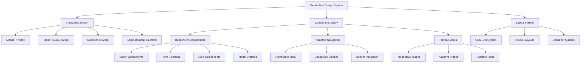

# Responsive Design Implementation

## Overview

This design document outlines the comprehensive responsive design system for VaultMeet, transforming the existing Next.js application with Tailwind CSS into a fully responsive platform. The design focuses on creating a mobile-first, accessible, and performant experience across all device types while maintaining the existing functionality and visual identity.

## Architecture

### Responsive Design System Architecture



### Technology Stack Integration

- **Next.js 15.3.3**: Server-side rendering with responsive meta tags
- **Tailwind CSS 4**: Mobile-first utility classes and custom responsive utilities
- **TypeScript**: Type-safe responsive component props
- **React 19**: Modern hooks for responsive state management
- **CSS Grid & Flexbox**: Advanced layout systems
- **Container Queries**: Component-level responsive design

## Components and Interfaces

### 1. Responsive Breakpoint System

```typescript
// types/responsive.ts
export interface BreakpointConfig {
  mobile: string;
  tablet: string;
  desktop: string;
  largeDesktop: string;
}

export interface ResponsiveProps {
  mobile?: any;
  tablet?: any;
  desktop?: any;
  largeDesktop?: any;
}

// utils/responsive.ts
export const BREAKPOINTS: BreakpointConfig = {
  mobile: '0px',
  tablet: '768px', 
  desktop: '1024px',
  largeDesktop: '1440px'
};
```

### 2. Responsive Navigation System

**Current State Analysis:**
- Desktop navigation uses fixed width (450px) with horizontal layout
- Mobile menu exists but needs enhancement
- Notification system needs mobile optimization

**Enhanced Navigation Design:**

```typescript
// components/Navigation/ResponsiveNavbar.tsx
interface ResponsiveNavbarProps {
  variant?: 'desktop' | 'tablet' | 'mobile';
  isMenuOpen?: boolean;
  onMenuToggle?: () => void;
}

// Navigation States:
// - Desktop: Full horizontal navigation with dropdowns
// - Tablet: Condensed navigation with collapsible sections  
// - Mobile: Hamburger menu with full-screen overlay
```

### 3. Responsive Layout Components

**Grid System:**
```scss
// styles/responsive-grid.scss
.responsive-grid {
  display: grid;
  gap: 1rem;
  
  // Mobile: Single column
  grid-template-columns: 1fr;
  
  // Tablet: 2-3 columns based on content
  @media (min-width: 768px) {
    grid-template-columns: repeat(auto-fit, minmax(300px, 1fr));
    gap: 1.5rem;
  }
  
  // Desktop: Full grid system
  @media (min-width: 1024px) {
    grid-template-columns: repeat(12, 1fr);
    gap: 2rem;
  }
}
```

**Container System:**
```typescript
// components/Layout/ResponsiveContainer.tsx
interface ContainerProps {
  maxWidth?: 'sm' | 'md' | 'lg' | 'xl' | 'full';
  padding?: ResponsiveSpacing;
  children: React.ReactNode;
}

// Container sizes:
// sm: 640px, md: 768px, lg: 1024px, xl: 1280px, full: 100%
```

### 4. Responsive Component Library

**Button System:**
```typescript
// components/UI/ResponsiveButton.tsx
interface ResponsiveButtonProps {
  size?: ResponsiveSize;
  variant?: 'primary' | 'secondary' | 'ghost';
  fullWidth?: ResponsiveBoolean;
  touchOptimized?: boolean;
}

// Touch targets: minimum 44px x 44px on mobile
// Hover states: disabled on touch devices
// Focus states: enhanced for keyboard navigation
```

**Form Elements:**
```typescript
// components/Forms/ResponsiveForm.tsx
interface ResponsiveFormProps {
  layout?: 'stacked' | 'inline' | 'responsive';
  fieldSpacing?: ResponsiveSpacing;
  labelPosition?: 'top' | 'left' | 'responsive';
}

// Mobile: Always stacked layout
// Tablet: Responsive layout based on content
// Desktop: Inline or custom layouts
```

**Modal System:**
```typescript
// components/Modals/ResponsiveModal.tsx
interface ResponsiveModalProps {
  size?: ResponsiveSize;
  fullScreenOnMobile?: boolean;
  slideDirection?: 'bottom' | 'top' | 'left' | 'right';
}

// Mobile: Full-screen or bottom sheet
// Tablet: Centered with appropriate sizing
// Desktop: Traditional modal positioning
```

### 5. Game Component Responsiveness

**Phaser Game Integration:**
```typescript
// components/Game/ResponsivePhaserGame.tsx
interface ResponsiveGameProps {
  autoResize?: boolean;
  minWidth?: number;
  minHeight?: number;
  aspectRatio?: string;
}

// Game canvas scaling strategies:
// - Maintain aspect ratio
// - Scale to fit container
// - Minimum playable dimensions
```

**Chat and Control Systems:**
```typescript
// components/Game/ResponsiveChatBox.tsx
interface ResponsiveChatProps {
  position?: 'overlay' | 'sidebar' | 'bottom';
  collapsible?: boolean;
  mobileOptimized?: boolean;
}

// Mobile: Bottom overlay or full-screen
// Tablet: Collapsible sidebar
// Desktop: Fixed sidebar or overlay
```

## Data Models

### 1. Responsive Configuration Model

```typescript
interface ResponsiveConfig {
  breakpoints: BreakpointConfig;
  spacing: ResponsiveSpacingScale;
  typography: ResponsiveTypographyScale;
  components: ComponentResponsiveSettings;
}

interface ResponsiveSpacingScale {
  xs: ResponsiveValue<string>;
  sm: ResponsiveValue<string>;
  md: ResponsiveValue<string>;
  lg: ResponsiveValue<string>;
  xl: ResponsiveValue<string>;
}

interface ResponsiveTypographyScale {
  headings: {
    h1: ResponsiveValue<string>;
    h2: ResponsiveValue<string>;
    h3: ResponsiveValue<string>;
    h4: ResponsiveValue<string>;
  };
  body: ResponsiveValue<string>;
  caption: ResponsiveValue<string>;
}
```

### 2. Device Detection Model

```typescript
interface DeviceInfo {
  type: 'mobile' | 'tablet' | 'desktop';
  orientation: 'portrait' | 'landscape';
  screenSize: {
    width: number;
    height: number;
  };
  touchCapable: boolean;
  pixelRatio: number;
}

interface ViewportInfo {
  width: number;
  height: number;
  breakpoint: keyof BreakpointConfig;
  isLandscape: boolean;
}
```

### 3. Component State Model

```typescript
interface ResponsiveComponentState {
  currentBreakpoint: keyof BreakpointConfig;
  isMenuOpen: boolean;
  sidebarCollapsed: boolean;
  modalFullScreen: boolean;
  orientationLocked: boolean;
}
```

## Error Handling

### 1. Responsive Fallbacks

```typescript
// hooks/useResponsiveFallback.ts
interface ResponsiveFallbackConfig {
  component: string;
  fallbackBreakpoint: keyof BreakpointConfig;
  fallbackProps: Record<string, any>;
  errorBoundary?: boolean;
}

// Fallback strategies:
// - Graceful degradation to simpler layouts
// - Default mobile-first rendering
// - Error boundary with responsive error pages
```

### 2. Layout Shift Prevention

```typescript
// utils/layoutStability.ts
interface LayoutStabilityConfig {
  reserveSpace: boolean;
  skeletonLoading: boolean;
  dimensionHints: {
    width?: string;
    height?: string;
    aspectRatio?: string;
  };
}

// Strategies:
// - CSS aspect-ratio for media
// - Skeleton screens during loading
// - Reserved space for dynamic content
```

### 3. Performance Monitoring

```typescript
// utils/responsivePerformance.ts
interface ResponsivePerformanceMetrics {
  layoutShifts: number;
  renderTime: number;
  breakpointSwitchTime: number;
  touchResponseTime: number;
}

// Monitoring:
// - Core Web Vitals tracking
// - Responsive transition performance
// - Touch interaction latency
```

## Testing Strategy

### 1. Responsive Testing Framework

```typescript
// testing/responsive.test.ts
interface ResponsiveTestConfig {
  breakpoints: BreakpointConfig;
  components: string[];
  interactions: ResponsiveInteraction[];
  accessibility: AccessibilityTest[];
}

interface ResponsiveInteraction {
  type: 'touch' | 'mouse' | 'keyboard';
  target: string;
  expectedBehavior: string;
}
```

### 2. Cross-Device Testing

**Testing Matrix:**
- **Mobile Devices**: iPhone SE, iPhone 14, Samsung Galaxy S21, Google Pixel 6
- **Tablets**: iPad Mini, iPad Pro, Samsung Galaxy Tab, Surface Pro
- **Desktop**: 1024px, 1366px, 1920px, 4K displays
- **Orientations**: Portrait and landscape for all devices

### 3. Performance Testing

```typescript
// testing/performance.test.ts
interface PerformanceTestSuite {
  loadTime: ResponsiveLoadTimeTest;
  interactionLatency: TouchInteractionTest;
  layoutStability: LayoutShiftTest;
  memoryUsage: ResponsiveMemoryTest;
}

// Performance benchmarks:
// - First Contentful Paint < 1.5s on 3G
// - Touch response < 100ms
// - Layout shift score < 0.1
// - Memory usage optimization per device
```

### 4. Accessibility Testing

```typescript
// testing/accessibility.test.ts
interface AccessibilityTestSuite {
  keyboardNavigation: KeyboardTest[];
  screenReader: ScreenReaderTest[];
  colorContrast: ContrastTest[];
  focusManagement: FocusTest[];
}

// Accessibility requirements:
// - WCAG 2.1 AA compliance
// - Keyboard navigation on all devices
// - Screen reader compatibility
// - Focus management across breakpoints
```

## Implementation Phases

### Phase 1: Foundation (Week 1-2)
1. **Responsive Infrastructure Setup**
   - Configure Tailwind CSS 4 with custom breakpoints
   - Create responsive utility functions and hooks
   - Set up responsive testing environment

2. **Core Layout System**
   - Implement responsive container system
   - Create flexible grid components
   - Build responsive spacing utilities

### Phase 2: Navigation & Core Components (Week 3-4)
1. **Enhanced Navigation System**
   - Redesign navbar for all breakpoints
   - Implement mobile hamburger menu
   - Create responsive notification system

2. **Essential UI Components**
   - Responsive button system
   - Adaptive form components
   - Flexible modal system

### Phase 3: Content & Media (Week 5-6)
1. **Responsive Content Areas**
   - Adapt home page sections
   - Responsive dashboard layouts
   - Flexible profile components

2. **Media Optimization**
   - Responsive image system
   - Adaptive video players
   - Scalable icon system

### Phase 4: Game & Interactive Features (Week 7-8)
1. **Game Component Responsiveness**
   - Responsive Phaser game integration
   - Adaptive chat systems
   - Mobile-optimized controls

2. **Advanced Interactions**
   - Touch gesture support
   - Responsive whiteboard
   - Mobile coding challenge interface

### Phase 5: Optimization & Testing (Week 9-10)
1. **Performance Optimization**
   - Bundle size optimization
   - Lazy loading implementation
   - Image optimization pipeline

2. **Comprehensive Testing**
   - Cross-device testing
   - Accessibility validation
   - Performance benchmarking

## Design Decisions and Rationales

### 1. Mobile-First Approach
**Decision**: Implement mobile-first responsive design
**Rationale**: 
- Ensures optimal mobile experience
- Progressive enhancement for larger screens
- Better performance on constrained devices
- Aligns with modern web standards

### 2. Tailwind CSS 4 Integration
**Decision**: Leverage Tailwind CSS 4 for responsive utilities
**Rationale**:
- Consistent design system
- Utility-first approach reduces CSS bundle size
- Built-in responsive modifiers
- Easy maintenance and customization

### 3. Component-Level Responsiveness
**Decision**: Implement responsiveness at the component level
**Rationale**:
- Better encapsulation and reusability
- Easier testing and maintenance
- Flexible composition patterns
- Reduced prop drilling

### 4. Touch-First Interactions
**Decision**: Design interactions for touch devices first
**Rationale**:
- Growing mobile usage
- Better accessibility
- Consistent interaction patterns
- Future-proof design approach

### 5. Performance-Conscious Implementation
**Decision**: Prioritize performance in responsive design
**Rationale**:
- Mobile devices have limited resources
- Better user experience
- SEO benefits
- Reduced bounce rates

This design provides a comprehensive foundation for implementing responsive design across the entire VaultMeet platform while maintaining performance, accessibility, and user experience standards.